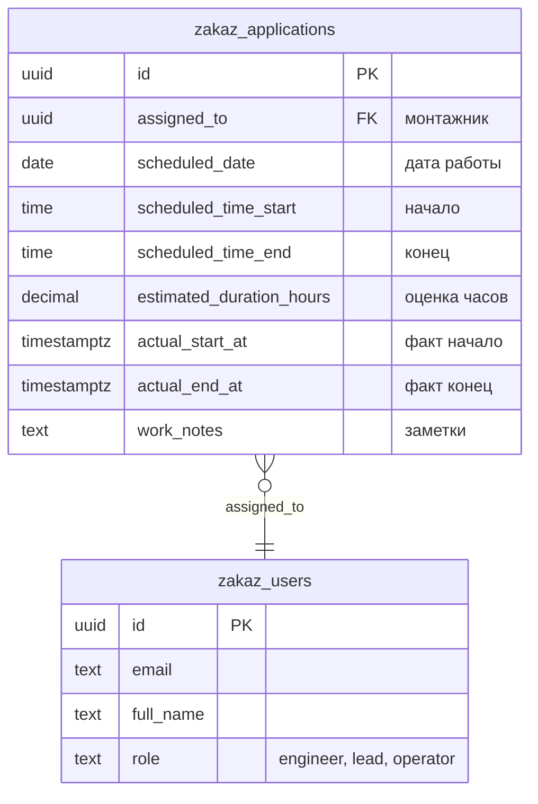
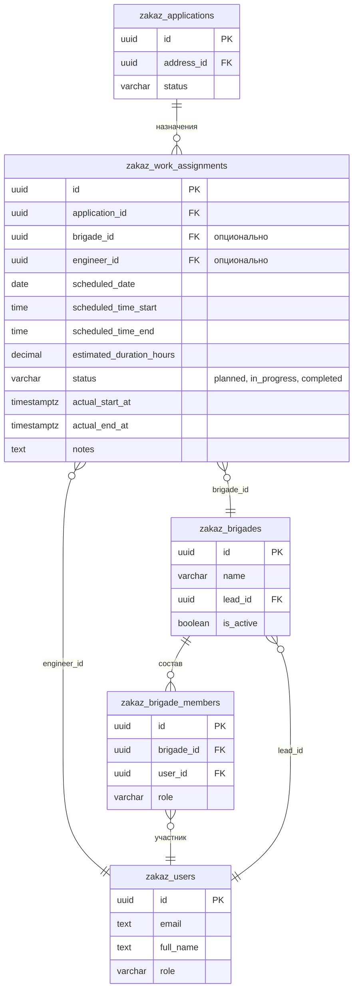

# Примеры кода для системы планирования монтажников

**Дата:** 17 ноября 2025

---

## 📊 Схема базы данных

### Вариант 1: Простой (MVP)



### Вариант 2: С бригадами (полная версия)



---

## 🗄️ Миграции БД

### Миграция 1: Добавление полей планирования (простой вариант)

```sql
-- database/migrations/012_add_scheduling_fields.sql

-- Добавляем поля планирования в applications
ALTER TABLE zakaz_applications
  ADD COLUMN IF NOT EXISTS scheduled_date DATE,
  ADD COLUMN IF NOT EXISTS scheduled_time_start TIME,
  ADD COLUMN IF NOT EXISTS scheduled_time_end TIME,
  ADD COLUMN IF NOT EXISTS estimated_duration_hours DECIMAL(4,2),
  ADD COLUMN IF NOT EXISTS actual_start_at TIMESTAMPTZ,
  ADD COLUMN IF NOT EXISTS actual_end_at TIMESTAMPTZ,
  ADD COLUMN IF NOT EXISTS work_notes TEXT;

-- Создаем индекс для быстрого поиска по дате и монтажнику
CREATE INDEX idx_applications_schedule
ON zakaz_applications(scheduled_date, assigned_to)
WHERE scheduled_date IS NOT NULL AND assigned_to IS NOT NULL;

-- Комментарии
COMMENT ON COLUMN zakaz_applications.scheduled_date IS 'Запланированная дата выполнения работы';
COMMENT ON COLUMN zakaz_applications.scheduled_time_start IS 'Плановое время начала работы';
COMMENT ON COLUMN zakaz_applications.scheduled_time_end IS 'Плановое время окончания работы';
COMMENT ON COLUMN zakaz_applications.estimated_duration_hours IS 'Оценка длительности работы в часах';
COMMENT ON COLUMN zakaz_applications.actual_start_at IS 'Фактическое время начала работы';
COMMENT ON COLUMN zakaz_applications.actual_end_at IS 'Фактическое время завершения работы';
COMMENT ON COLUMN zakaz_applications.work_notes IS 'Заметки для монтажника';
```

### Миграция 2: Таблицы для бригад (полный вариант)

```sql
-- database/migrations/013_create_brigades_and_assignments.sql

-- 1. Таблица бригад
CREATE TABLE zakaz_brigades (
  id UUID PRIMARY KEY DEFAULT gen_random_uuid(),
  name VARCHAR(255) NOT NULL,
  lead_id UUID REFERENCES zakaz_users(id) ON DELETE SET NULL,
  description TEXT,
  is_active BOOLEAN DEFAULT TRUE,
  created_at TIMESTAMPTZ DEFAULT NOW(),
  updated_at TIMESTAMPTZ DEFAULT NOW()
);

-- 2. Состав бригад
CREATE TABLE zakaz_brigade_members (
  id UUID PRIMARY KEY DEFAULT gen_random_uuid(),
  brigade_id UUID NOT NULL REFERENCES zakaz_brigades(id) ON DELETE CASCADE,
  user_id UUID NOT NULL REFERENCES zakaz_users(id) ON DELETE CASCADE,
  role VARCHAR(50),
  joined_at TIMESTAMPTZ DEFAULT NOW(),
  UNIQUE(brigade_id, user_id)
);

-- 3. Назначения работ
CREATE TABLE zakaz_work_assignments (
  id UUID PRIMARY KEY DEFAULT gen_random_uuid(),
  application_id UUID NOT NULL REFERENCES zakaz_applications(id) ON DELETE CASCADE,

  -- Кто назначен (либо бригада, либо монтажник)
  brigade_id UUID REFERENCES zakaz_brigades(id) ON DELETE SET NULL,
  engineer_id UUID REFERENCES zakaz_users(id) ON DELETE SET NULL,

  -- Планирование
  scheduled_date DATE NOT NULL,
  scheduled_time_start TIME NOT NULL,
  scheduled_time_end TIME NOT NULL,
  estimated_duration_hours DECIMAL(4,2),

  -- Статус выполнения
  status VARCHAR(50) DEFAULT 'planned',
  actual_start_at TIMESTAMPTZ,
  actual_end_at TIMESTAMPTZ,
  actual_duration_hours DECIMAL(4,2),

  -- Метаданные
  notes TEXT,
  created_by UUID REFERENCES zakaz_users(id),
  created_at TIMESTAMPTZ DEFAULT NOW(),
  updated_at TIMESTAMPTZ DEFAULT NOW(),

  -- Проверка: должен быть назначен либо бригада, либо монтажник
  CONSTRAINT check_assignment_type CHECK (
    (brigade_id IS NOT NULL AND engineer_id IS NULL) OR
    (brigade_id IS NULL AND engineer_id IS NOT NULL)
  )
);

-- Индексы
CREATE INDEX idx_brigades_lead ON zakaz_brigades(lead_id);
CREATE INDEX idx_brigades_active ON zakaz_brigades(is_active);
CREATE INDEX idx_brigade_members_brigade ON zakaz_brigade_members(brigade_id);
CREATE INDEX idx_brigade_members_user ON zakaz_brigade_members(user_id);
CREATE INDEX idx_work_assignments_application ON zakaz_work_assignments(application_id);
CREATE INDEX idx_work_assignments_date ON zakaz_work_assignments(scheduled_date);
CREATE INDEX idx_work_assignments_brigade_date ON zakaz_work_assignments(brigade_id, scheduled_date);
CREATE INDEX idx_work_assignments_engineer_date ON zakaz_work_assignments(engineer_id, scheduled_date);
CREATE INDEX idx_work_assignments_status ON zakaz_work_assignments(status);

-- Триггеры для updated_at
CREATE TRIGGER update_brigades_updated_at
  BEFORE UPDATE ON zakaz_brigades
  FOR EACH ROW EXECUTE FUNCTION update_updated_at_column();

CREATE TRIGGER update_work_assignments_updated_at
  BEFORE UPDATE ON zakaz_work_assignments
  FOR EACH ROW EXECUTE FUNCTION update_updated_at_column();

-- Комментарии
COMMENT ON TABLE zakaz_brigades IS 'Монтажные бригады';
COMMENT ON TABLE zakaz_brigade_members IS 'Состав бригад';
COMMENT ON TABLE zakaz_work_assignments IS 'Назначения работ по заявкам';
COMMENT ON COLUMN zakaz_work_assignments.status IS 'planned, in_progress, completed, cancelled';
```

---

## 📝 TypeScript типы

```typescript
// lib/types.ts

// Существующие типы
export interface User {
  id: string;
  email: string;
  full_name: string;
  phone?: string;
  role: 'admin' | 'operator' | 'engineer' | 'lead';
  active: boolean;
  created_at: string;
  updated_at: string;
}

export interface Application {
  id: string;
  address_id: string;
  customer_type: 'individual' | 'business';
  service_type: 'apartment' | 'office' | 'scs';
  customer_fullname: string;
  customer_phone: string;
  contact_person?: string;
  contact_phone?: string;
  urgency: 'low' | 'normal' | 'high' | 'critical';
  status: ApplicationStatus;
  assigned_to?: string;
  client_comment?: string;
  created_at: string;
  updated_at: string;

  // Новые поля для планирования (вариант 1 - простой)
  scheduled_date?: string;
  scheduled_time_start?: string;
  scheduled_time_end?: string;
  estimated_duration_hours?: number;
  actual_start_at?: string;
  actual_end_at?: string;
  work_notes?: string;

  // Связи
  address?: Address;
  assigned_user?: User;
}

// Новые типы для бригад (вариант 2 - полный)

export interface Brigade {
  id: string;
  name: string;
  lead_id?: string;
  description?: string;
  is_active: boolean;
  created_at: string;
  updated_at: string;

  // Связи
  lead?: User;
  members?: BrigadeMember[];
}

export interface BrigadeMember {
  id: string;
  brigade_id: string;
  user_id: string;
  role?: string;
  joined_at: string;

  // Связи
  user?: User;
  brigade?: Brigade;
}

export type WorkAssignmentStatus = 'planned' | 'in_progress' | 'completed' | 'cancelled';

export interface WorkAssignment {
  id: string;
  application_id: string;

  // Назначение (либо бригада, либо монтажник)
  brigade_id?: string;
  engineer_id?: string;

  // Планирование
  scheduled_date: string;
  scheduled_time_start: string;
  scheduled_time_end: string;
  estimated_duration_hours?: number;

  // Выполнение
  status: WorkAssignmentStatus;
  actual_start_at?: string;
  actual_end_at?: string;
  actual_duration_hours?: number;

  // Метаданные
  notes?: string;
  created_by?: string;
  created_at: string;
  updated_at: string;

  // Связи
  application?: Application;
  brigade?: Brigade;
  engineer?: User;
  created_by_user?: User;
}

// Типы для загрузки монтажников

export interface TimeSlot {
  start: string;  // "08:00"
  end: string;    // "10:00"
  duration: number; // 2
}

export interface AssignmentSummary {
  id: string;
  application_id: string;
  application_number?: number;
  time_start: string;
  time_end: string;
  duration_hours: number;
  address?: string;
  urgency?: string;
}

export type WorkloadStatus = 'available' | 'busy' | 'overloaded';

export interface EngineerWorkload {
  engineer_id: string;
  engineer_name: string;
  date: string;

  // Рабочий день
  work_day_start: string;
  work_day_end: string;
  total_work_hours: number;

  // Загрузка
  planned_work_hours: number;
  available_hours: number;
  utilization_percent: number;

  // Статус
  status: WorkloadStatus;

  // Детали
  assignments: AssignmentSummary[];
  free_slots: TimeSlot[];
}

export interface BrigadeWorkload {
  brigade_id: string;
  brigade_name: string;
  date: string;

  // Общая загрузка бригады (сумма всех участников)
  total_capacity_hours: number; // members.length * 10
  planned_work_hours: number;
  available_hours: number;
  utilization_percent: number;

  status: WorkloadStatus;

  // Детали
  members: {
    user_id: string;
    user_name: string;
    planned_hours: number;
  }[];
  assignments: AssignmentSummary[];
}

export interface WorkloadSummary {
  date: string;
  total_engineers: number;
  available: number;
  busy: number;
  overloaded: number;
  total_capacity_hours: number;
  total_planned_hours: number;
  avg_utilization_percent: number;
}
```

---

## 🔌 API Routes

### 1. Планирование работы (простой вариант)

```typescript
// app/api/applications/[id]/schedule/route.ts

import { NextRequest, NextResponse } from 'next/server';
import { createClient } from '@/lib/supabase/server';
import { logAudit } from '@/lib/audit-log';

export async function PATCH(
  request: NextRequest,
  { params }: { params: { id: string } }
) {
  try {
    const supabase = await createClient();
    const body = await request.json();

    const {
      scheduled_date,
      scheduled_time_start,
      scheduled_time_end,
      estimated_duration_hours,
      work_notes,
    } = body;

    // Валидация
    if (!scheduled_date || !scheduled_time_start || !scheduled_time_end) {
      return NextResponse.json(
        { error: 'Обязательные поля: scheduled_date, scheduled_time_start, scheduled_time_end' },
        { status: 400 }
      );
    }

    // Проверка существования заявки
    const { data: application, error: appError } = await supabase
      .from('zakaz_applications')
      .select('*')
      .eq('id', params.id)
      .single();

    if (appError || !application) {
      return NextResponse.json(
        { error: 'Заявка не найдена' },
        { status: 404 }
      );
    }

    // Проверка назначенного монтажника
    if (!application.assigned_to) {
      return NextResponse.json(
        { error: 'Сначала назначьте монтажника на заявку' },
        { status: 400 }
      );
    }

    // Проверка конфликтов расписания
    const conflicts = await checkScheduleConflicts(
      supabase,
      application.assigned_to,
      scheduled_date,
      scheduled_time_start,
      scheduled_time_end,
      params.id
    );

    if (conflicts.length > 0) {
      return NextResponse.json(
        {
          error: 'Конфликт расписания',
          conflicts,
          warning: 'Монтажник уже занят в это время'
        },
        { status: 409 }
      );
    }

    // Обновление заявки
    const { data: updated, error: updateError } = await supabase
      .from('zakaz_applications')
      .update({
        scheduled_date,
        scheduled_time_start,
        scheduled_time_end,
        estimated_duration_hours,
        work_notes,
        updated_at: new Date().toISOString(),
      })
      .eq('id', params.id)
      .select(`
        *,
        address:zakaz_addresses(*),
        assigned_user:zakaz_users(id, full_name, phone, role)
      `)
      .single();

    if (updateError) {
      throw updateError;
    }

    // Логирование
    await logAudit(supabase, {
      user_id: application.assigned_to,
      action_type: 'schedule',
      entity_type: 'application',
      entity_id: params.id,
      description: `Запланирована работа на ${scheduled_date} ${scheduled_time_start}-${scheduled_time_end}`,
      new_values: {
        scheduled_date,
        scheduled_time_start,
        scheduled_time_end,
        estimated_duration_hours,
      },
    });

    return NextResponse.json(updated);

  } catch (error) {
    console.error('Error scheduling work:', error);
    return NextResponse.json(
      { error: 'Internal server error' },
      { status: 500 }
    );
  }
}

// Функция проверки конфликтов
async function checkScheduleConflicts(
  supabase: any,
  engineerId: string,
  date: string,
  timeStart: string,
  timeEnd: string,
  excludeApplicationId?: string
) {
  const { data: conflicts, error } = await supabase
    .from('zakaz_applications')
    .select('id, scheduled_time_start, scheduled_time_end, address:zakaz_addresses(street, house)')
    .eq('assigned_to', engineerId)
    .eq('scheduled_date', date)
    .neq('id', excludeApplicationId || '')
    .not('scheduled_time_start', 'is', null);

  if (error) throw error;

  // Проверка пересечения временных интервалов
  return conflicts.filter((app: any) => {
    return timeIntervalsOverlap(
      timeStart,
      timeEnd,
      app.scheduled_time_start,
      app.scheduled_time_end
    );
  });
}

function timeIntervalsOverlap(
  start1: string,
  end1: string,
  start2: string,
  end2: string
): boolean {
  return start1 < end2 && start2 < end1;
}
```

### 2. Получение загрузки монтажников

```typescript
// app/api/workload/engineers/route.ts

import { NextRequest, NextResponse } from 'next/server';
import { createClient } from '@/lib/supabase/server';
import { EngineerWorkload, WorkloadSummary } from '@/lib/types';

const WORK_DAY_START = '08:00';
const WORK_DAY_END = '18:00';
const TOTAL_WORK_HOURS = 10;

export async function GET(request: NextRequest) {
  try {
    const supabase = await createClient();
    const { searchParams } = new URL(request.url);
    const date = searchParams.get('date') || new Date().toISOString().split('T')[0];

    // Получить всех активных инженеров
    const { data: engineers, error: engineersError } = await supabase
      .from('zakaz_users')
      .select('id, full_name')
      .eq('role', 'engineer')
      .eq('active', true)
      .order('full_name');

    if (engineersError) throw engineersError;

    // Получить все назначения на эту дату
    const { data: applications, error: appsError } = await supabase
      .from('zakaz_applications')
      .select(`
        id,
        assigned_to,
        scheduled_time_start,
        scheduled_time_end,
        estimated_duration_hours,
        urgency,
        address:zakaz_addresses(street, house)
      `)
      .eq('scheduled_date', date)
      .not('assigned_to', 'is', null)
      .not('scheduled_time_start', 'is', null);

    if (appsError) throw appsError;

    // Рассчитать загрузку для каждого инженера
    const workloads: EngineerWorkload[] = engineers.map(engineer => {
      const engineerApps = applications.filter(app => app.assigned_to === engineer.id);

      const plannedHours = engineerApps.reduce(
        (sum, app) => sum + (app.estimated_duration_hours || 0),
        0
      );

      const availableHours = TOTAL_WORK_HOURS - plannedHours;
      const utilization = (plannedHours / TOTAL_WORK_HOURS) * 100;

      let status: 'available' | 'busy' | 'overloaded';
      if (plannedHours >= 9) status = 'overloaded';
      else if (plannedHours >= 7) status = 'busy';
      else status = 'available';

      const assignments = engineerApps.map(app => ({
        id: app.id,
        application_id: app.id,
        time_start: app.scheduled_time_start,
        time_end: app.scheduled_time_end,
        duration_hours: app.estimated_duration_hours || 0,
        address: app.address ? `${app.address.street} ${app.address.house}` : '',
        urgency: app.urgency,
      }));

      const freeSlots = calculateFreeSlots(engineerApps);

      return {
        engineer_id: engineer.id,
        engineer_name: engineer.full_name,
        date,
        work_day_start: WORK_DAY_START,
        work_day_end: WORK_DAY_END,
        total_work_hours: TOTAL_WORK_HOURS,
        planned_work_hours: plannedHours,
        available_hours: availableHours,
        utilization_percent: Math.round(utilization),
        status,
        assignments,
        free_slots: freeSlots,
      };
    });

    // Сводка
    const summary: WorkloadSummary = {
      date,
      total_engineers: engineers.length,
      available: workloads.filter(w => w.status === 'available').length,
      busy: workloads.filter(w => w.status === 'busy').length,
      overloaded: workloads.filter(w => w.status === 'overloaded').length,
      total_capacity_hours: engineers.length * TOTAL_WORK_HOURS,
      total_planned_hours: workloads.reduce((sum, w) => sum + w.planned_work_hours, 0),
      avg_utilization_percent: Math.round(
        workloads.reduce((sum, w) => sum + w.utilization_percent, 0) / engineers.length
      ),
    };

    return NextResponse.json({
      date,
      engineers: workloads,
      summary,
    });

  } catch (error) {
    console.error('Error fetching workload:', error);
    return NextResponse.json(
      { error: 'Internal server error' },
      { status: 500 }
    );
  }
}

function calculateFreeSlots(applications: any[]) {
  if (applications.length === 0) {
    return [{
      start: WORK_DAY_START,
      end: WORK_DAY_END,
      duration: TOTAL_WORK_HOURS,
    }];
  }

  // Сортировать по времени начала
  const sorted = [...applications].sort((a, b) =>
    a.scheduled_time_start.localeCompare(b.scheduled_time_start)
  );

  const slots = [];
  let currentTime = WORK_DAY_START;

  for (const app of sorted) {
    if (currentTime < app.scheduled_time_start) {
      const duration = timeDiffInHours(currentTime, app.scheduled_time_start);
      slots.push({
        start: currentTime,
        end: app.scheduled_time_start,
        duration,
      });
    }
    currentTime = app.scheduled_time_end;
  }

  // Свободное время после последней работы
  if (currentTime < WORK_DAY_END) {
    const duration = timeDiffInHours(currentTime, WORK_DAY_END);
    slots.push({
      start: currentTime,
      end: WORK_DAY_END,
      duration,
    });
  }

  return slots;
}

function timeDiffInHours(start: string, end: string): number {
  const [startH, startM] = start.split(':').map(Number);
  const [endH, endM] = end.split(':').map(Number);
  return (endH * 60 + endM - startH * 60 - startM) / 60;
}
```

### 3. Создание бригады (полный вариант)

```typescript
// app/api/brigades/route.ts

import { NextRequest, NextResponse } from 'next/server';
import { createClient } from '@/lib/supabase/server';

export async function POST(request: NextRequest) {
  try {
    const supabase = await createClient();
    const body = await request.json();

    const { name, lead_id, description, member_ids } = body;

    // Валидация
    if (!name) {
      return NextResponse.json(
        { error: 'Название бригады обязательно' },
        { status: 400 }
      );
    }

    // Создать бригаду
    const { data: brigade, error: brigadeError } = await supabase
      .from('zakaz_brigades')
      .insert({
        name,
        lead_id,
        description,
      })
      .select()
      .single();

    if (brigadeError) throw brigadeError;

    // Добавить участников
    if (member_ids && member_ids.length > 0) {
      const members = member_ids.map((userId: string) => ({
        brigade_id: brigade.id,
        user_id: userId,
        role: userId === lead_id ? 'lead' : 'engineer',
      }));

      const { error: membersError } = await supabase
        .from('zakaz_brigade_members')
        .insert(members);

      if (membersError) throw membersError;
    }

    // Получить полные данные бригады
    const { data: fullBrigade } = await supabase
      .from('zakaz_brigades')
      .select(`
        *,
        lead:zakaz_users!lead_id(id, full_name),
        members:zakaz_brigade_members(
          id,
          role,
          user:zakaz_users(id, full_name, phone, role)
        )
      `)
      .eq('id', brigade.id)
      .single();

    return NextResponse.json(fullBrigade, { status: 201 });

  } catch (error) {
    console.error('Error creating brigade:', error);
    return NextResponse.json(
      { error: 'Internal server error' },
      { status: 500 }
    );
  }
}

export async function GET(request: NextRequest) {
  try {
    const supabase = await createClient();

    const { data: brigades, error } = await supabase
      .from('zakaz_brigades')
      .select(`
        *,
        lead:zakaz_users!lead_id(id, full_name),
        members:zakaz_brigade_members(
          id,
          role,
          user:zakaz_users(id, full_name, phone, role)
        )
      `)
      .eq('is_active', true)
      .order('name');

    if (error) throw error;

    return NextResponse.json({ brigades });

  } catch (error) {
    console.error('Error fetching brigades:', error);
    return NextResponse.json(
      { error: 'Internal server error' },
      { status: 500 }
    );
  }
}
```

---

## 🎨 React компоненты

### 1. Модальное окно планирования

```tsx
// app/components/ScheduleWorkModal.tsx

'use client';

import { useState, useEffect } from 'react';
import { EngineerWorkload } from '@/lib/types';

interface ScheduleWorkModalProps {
  applicationId: string;
  currentAssignedTo?: string;
  onClose: () => void;
  onScheduled: () => void;
}

export default function ScheduleWorkModal({
  applicationId,
  currentAssignedTo,
  onClose,
  onScheduled,
}: ScheduleWorkModalProps) {
  const [selectedDate, setSelectedDate] = useState(
    new Date().toISOString().split('T')[0]
  );
  const [selectedEngineerId, setSelectedEngineerId] = useState(currentAssignedTo || '');
  const [timeStart, setTimeStart] = useState('09:00');
  const [timeEnd, setTimeEnd] = useState('12:00');
  const [notes, setNotes] = useState('');
  const [workloads, setWorkloads] = useState<EngineerWorkload[]>([]);
  const [loading, setLoading] = useState(false);

  // Загрузить загрузку монтажников при выборе даты
  useEffect(() => {
    async function fetchWorkloads() {
      const response = await fetch(`/api/workload/engineers?date=${selectedDate}`);
      const data = await response.json();
      setWorkloads(data.engineers || []);
    }
    fetchWorkloads();
  }, [selectedDate]);

  // Расчет длительности
  const duration = calculateDuration(timeStart, timeEnd);

  async function handleSubmit(e: React.FormEvent) {
    e.preventDefault();
    setLoading(true);

    try {
      // Сначала назначить монтажника (если не назначен)
      if (!currentAssignedTo) {
        await fetch(`/api/applications/${applicationId}/assign`, {
          method: 'PATCH',
          headers: { 'Content-Type': 'application/json' },
          body: JSON.stringify({ assigned_to: selectedEngineerId }),
        });
      }

      // Затем запланировать
      const response = await fetch(`/api/applications/${applicationId}/schedule`, {
        method: 'PATCH',
        headers: { 'Content-Type': 'application/json' },
        body: JSON.stringify({
          scheduled_date: selectedDate,
          scheduled_time_start: timeStart,
          scheduled_time_end: timeEnd,
          estimated_duration_hours: duration,
          work_notes: notes,
        }),
      });

      if (response.ok) {
        onScheduled();
      } else {
        const error = await response.json();
        alert(error.error || 'Ошибка при планировании');
      }
    } catch (error) {
      console.error('Error scheduling:', error);
      alert('Ошибка при планировании');
    } finally {
      setLoading(false);
    }
  }

  return (
    <div className="fixed inset-0 bg-black/50 flex items-center justify-center z-50">
      <div className="bg-white rounded-lg shadow-xl max-w-2xl w-full max-h-[90vh] overflow-auto p-6">
        <h2 className="text-2xl font-bold mb-4">📅 Запланировать работу</h2>

        <form onSubmit={handleSubmit} className="space-y-4">
          {/* Дата */}
          <div>
            <label className="block text-sm font-medium mb-1">
              Дата выполнения
            </label>
            <input
              type="date"
              value={selectedDate}
              onChange={(e) => setSelectedDate(e.target.value)}
              className="w-full px-3 py-2 border rounded-lg"
              required
            />
          </div>

          {/* Время */}
          <div className="grid grid-cols-2 gap-4">
            <div>
              <label className="block text-sm font-medium mb-1">
                Начало
              </label>
              <input
                type="time"
                value={timeStart}
                onChange={(e) => setTimeStart(e.target.value)}
                className="w-full px-3 py-2 border rounded-lg"
                required
              />
            </div>
            <div>
              <label className="block text-sm font-medium mb-1">
                Окончание
              </label>
              <input
                type="time"
                value={timeEnd}
                onChange={(e) => setTimeEnd(e.target.value)}
                className="w-full px-3 py-2 border rounded-lg"
                required
              />
            </div>
          </div>

          <div className="text-sm text-gray-600">
            Длительность: ~{duration} ч.
          </div>

          {/* Выбор монтажника */}
          <div>
            <label className="block text-sm font-medium mb-2">
              Монтажник
            </label>
            <div className="space-y-2">
              {workloads.map((workload) => (
                <label
                  key={workload.engineer_id}
                  className={`
                    flex items-center justify-between p-3 border rounded-lg cursor-pointer
                    ${selectedEngineerId === workload.engineer_id ? 'border-blue-500 bg-blue-50' : 'border-gray-300'}
                  `}
                >
                  <div className="flex items-center gap-3">
                    <input
                      type="radio"
                      name="engineer"
                      value={workload.engineer_id}
                      checked={selectedEngineerId === workload.engineer_id}
                      onChange={(e) => setSelectedEngineerId(e.target.value)}
                      required
                    />
                    <div>
                      <div className="font-medium">{workload.engineer_name}</div>
                      <div className="text-sm text-gray-600">
                        Свободен: {workload.available_hours} из {workload.total_work_hours} ч.
                      </div>
                    </div>
                  </div>
                  <div className="text-right">
                    <WorkloadBadge status={workload.status} />
                    <div className="text-sm text-gray-600 mt-1">
                      {workload.utilization_percent}%
                    </div>
                  </div>
                </label>
              ))}
            </div>
          </div>

          {/* Комментарий */}
          <div>
            <label className="block text-sm font-medium mb-1">
              Комментарий для монтажника
            </label>
            <textarea
              value={notes}
              onChange={(e) => setNotes(e.target.value)}
              className="w-full px-3 py-2 border rounded-lg"
              rows={3}
              placeholder="Клиент доступен только после 14:00..."
            />
          </div>

          {/* Кнопки */}
          <div className="flex gap-3 pt-4">
            <button
              type="button"
              onClick={onClose}
              className="flex-1 px-4 py-2 border border-gray-300 rounded-lg hover:bg-gray-50"
            >
              Отмена
            </button>
            <button
              type="submit"
              disabled={loading}
              className="flex-1 px-4 py-2 bg-blue-600 text-white rounded-lg hover:bg-blue-700 disabled:opacity-50"
            >
              {loading ? 'Сохранение...' : 'Запланировать'}
            </button>
          </div>
        </form>
      </div>
    </div>
  );
}

function WorkloadBadge({ status }: { status: string }) {
  const styles = {
    available: 'bg-green-100 text-green-800',
    busy: 'bg-yellow-100 text-yellow-800',
    overloaded: 'bg-red-100 text-red-800',
  };

  const labels = {
    available: '🟢 Доступен',
    busy: '🟡 Загружен',
    overloaded: '🔴 Перегружен',
  };

  return (
    <span className={`px-2 py-1 rounded text-xs font-medium ${styles[status as keyof typeof styles]}`}>
      {labels[status as keyof typeof labels]}
    </span>
  );
}

function calculateDuration(start: string, end: string): number {
  const [startH, startM] = start.split(':').map(Number);
  const [endH, endM] = end.split(':').map(Number);
  return Math.round((endH * 60 + endM - startH * 60 - startM) / 60 * 10) / 10;
}
```

### 2. Календарь загрузки на неделю

```tsx
// app/dashboard/schedule/page.tsx

'use client';

import { useState, useEffect } from 'react';
import { EngineerWorkload } from '@/lib/types';

export default function SchedulePage() {
  const [currentWeek, setCurrentWeek] = useState(getWeekDates(new Date()));
  const [engineers, setEngineers] = useState<any[]>([]);
  const [workloadByDate, setWorkloadByDate] = useState<Record<string, EngineerWorkload[]>>({});
  const [loading, setLoading] = useState(true);

  useEffect(() => {
    loadSchedule();
  }, [currentWeek]);

  async function loadSchedule() {
    setLoading(true);
    try {
      // Загрузить всех инженеров
      const engResponse = await fetch('/api/users?role=engineer');
      const engData = await engResponse.json();
      setEngineers(engData.users || []);

      // Загрузить загрузку для каждого дня недели
      const workloads: Record<string, EngineerWorkload[]> = {};

      for (const date of currentWeek) {
        const response = await fetch(`/api/workload/engineers?date=${date}`);
        const data = await response.json();
        workloads[date] = data.engineers || [];
      }

      setWorkloadByDate(workloads);
    } catch (error) {
      console.error('Error loading schedule:', error);
    } finally {
      setLoading(false);
    }
  }

  function prevWeek() {
    const firstDay = new Date(currentWeek[0]);
    firstDay.setDate(firstDay.getDate() - 7);
    setCurrentWeek(getWeekDates(firstDay));
  }

  function nextWeek() {
    const firstDay = new Date(currentWeek[0]);
    firstDay.setDate(firstDay.getDate() + 7);
    setCurrentWeek(getWeekDates(firstDay));
  }

  if (loading) {
    return <div className="p-8">Загрузка...</div>;
  }

  return (
    <div className="p-8">
      <div className="mb-6 flex items-center justify-between">
        <h1 className="text-3xl font-bold">📅 Планирование работ</h1>
        <div className="flex gap-2">
          <button
            onClick={prevWeek}
            className="px-4 py-2 bg-gray-200 rounded-lg hover:bg-gray-300"
          >
            ◀ Предыдущая неделя
          </button>
          <button
            onClick={nextWeek}
            className="px-4 py-2 bg-gray-200 rounded-lg hover:bg-gray-300"
          >
            Следующая неделя ▶
          </button>
        </div>
      </div>

      {/* Календарь */}
      <div className="overflow-x-auto">
        <table className="w-full border-collapse border">
          <thead>
            <tr className="bg-gray-100">
              <th className="border p-3 text-left">Монтажник</th>
              {currentWeek.map((date, idx) => (
                <th key={date} className="border p-3 text-center min-w-[150px]">
                  <div className="font-medium">
                    {['Пн', 'Вт', 'Ср', 'Чт', 'Пт', 'Сб', 'Вс'][idx]}
                  </div>
                  <div className="text-sm text-gray-600">
                    {formatDate(date)}
                  </div>
                </th>
              ))}
            </tr>
          </thead>
          <tbody>
            {engineers.map((engineer) => (
              <tr key={engineer.id} className="hover:bg-gray-50">
                <td className="border p-3 font-medium">
                  {engineer.full_name}
                </td>
                {currentWeek.map((date) => {
                  const workload = workloadByDate[date]?.find(
                    (w) => w.engineer_id === engineer.id
                  );

                  return (
                    <td key={date} className="border p-2">
                      {workload && (
                        <DayCell workload={workload} />
                      )}
                    </td>
                  );
                })}
              </tr>
            ))}
          </tbody>
        </table>
      </div>
    </div>
  );
}

function DayCell({ workload }: { workload: EngineerWorkload }) {
  const statusColors = {
    available: 'bg-green-50 border-green-200',
    busy: 'bg-yellow-50 border-yellow-200',
    overloaded: 'bg-red-50 border-red-200',
  };

  const statusIcons = {
    available: '🟢',
    busy: '🟡',
    overloaded: '🔴',
  };

  return (
    <div className={`rounded p-2 border ${statusColors[workload.status]}`}>
      <div className="flex items-center justify-between mb-2">
        <span className="text-xs font-medium">
          {statusIcons[workload.status]} {workload.planned_work_hours}/{workload.total_work_hours}ч
        </span>
        <span className="text-xs text-gray-600">
          {workload.utilization_percent}%
        </span>
      </div>

      <div className="space-y-1">
        {workload.assignments.map((assignment) => (
          <div
            key={assignment.id}
            className="text-xs bg-white rounded px-2 py-1 border border-gray-200"
          >
            <div className="font-medium">
              {assignment.time_start}-{assignment.time_end}
            </div>
            <div className="text-gray-600 truncate">
              #{assignment.application_id.slice(0, 8)}
            </div>
          </div>
        ))}
      </div>
    </div>
  );
}

function getWeekDates(date: Date): string[] {
  const day = date.getDay();
  const diff = date.getDate() - day + (day === 0 ? -6 : 1); // Понедельник
  const monday = new Date(date.setDate(diff));

  const dates = [];
  for (let i = 0; i < 7; i++) {
    const d = new Date(monday);
    d.setDate(monday.getDate() + i);
    dates.push(d.toISOString().split('T')[0]);
  }
  return dates;
}

function formatDate(dateStr: string): string {
  const date = new Date(dateStr);
  return `${date.getDate()}.${date.getMonth() + 1}`;
}
```

---

## 🔧 Утилиты

```typescript
// lib/scheduling-utils.ts

export interface WorkDayConfig {
  start: string;
  end: string;
  maxHours: number;
}

export const DEFAULT_WORK_DAY: WorkDayConfig = {
  start: '08:00',
  end: '18:00',
  maxHours: 10,
};

export function calculateWorkloadStatus(
  plannedHours: number,
  maxHours: number = DEFAULT_WORK_DAY.maxHours
): 'available' | 'busy' | 'overloaded' {
  const utilization = plannedHours / maxHours;

  if (utilization >= 0.9) return 'overloaded';
  if (utilization >= 0.7) return 'busy';
  return 'available';
}

export function timeToMinutes(time: string): number {
  const [hours, minutes] = time.split(':').map(Number);
  return hours * 60 + minutes;
}

export function minutesToTime(minutes: number): string {
  const hours = Math.floor(minutes / 60);
  const mins = minutes % 60;
  return `${String(hours).padStart(2, '0')}:${String(mins).padStart(2, '0')}`;
}

export function calculateDurationHours(start: string, end: string): number {
  const startMin = timeToMinutes(start);
  const endMin = timeToMinutes(end);
  return (endMin - startMin) / 60;
}

export function timesOverlap(
  start1: string,
  end1: string,
  start2: string,
  end2: string
): boolean {
  const start1Min = timeToMinutes(start1);
  const end1Min = timeToMinutes(end1);
  const start2Min = timeToMinutes(start2);
  const end2Min = timeToMinutes(end2);

  return start1Min < end2Min && start2Min < end1Min;
}
```

---

Этот файл содержит готовые примеры кода, которые можно использовать для реализации системы планирования!
